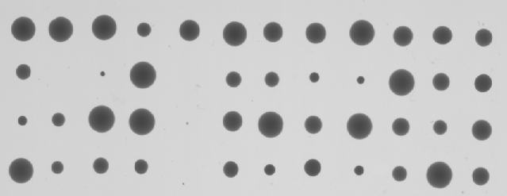
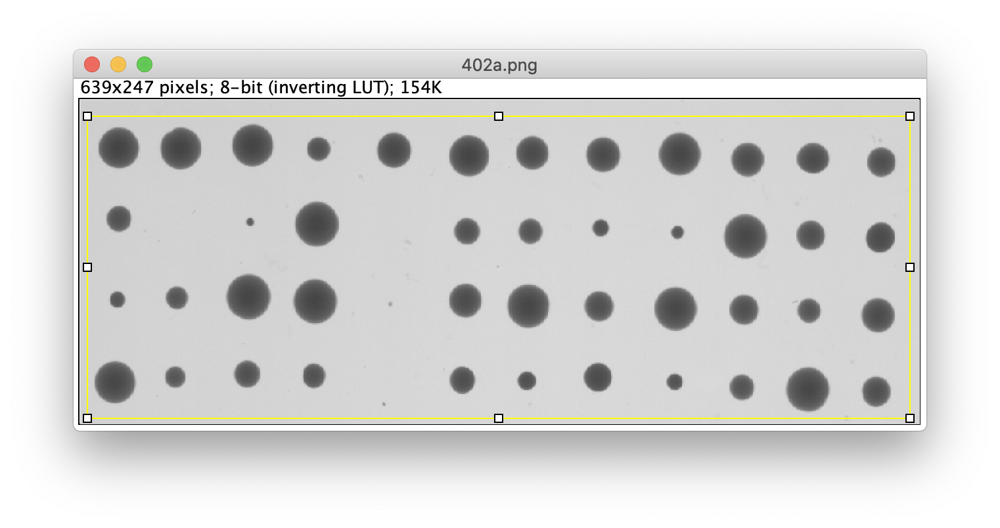

# dissectionReader
JCDittmar's dissection reader script for NIH Image

From December 2009

Link to original repository [here](https://sourceforge.net/projects/dissectionread/files/)

ImageJ macro for reading the size of colonies on scanned dissection plates.

Assumes a rectangular grid of colonies as in the example image below.

## Installation

Download `dissectionReader.txt` from this repository to a local folder.
Launch _ImageJ_ or _FIJI_ image analysis application.
From the menu `Plugins > install...` navigate to the downloaded copy of `dissectionReader.txt`
and `open` the script.
This installs the script as a menu item under `Plugins > Measure Colonies[m]`

## Measuring colonies

Open an image file containing colonies from a yeast dissection.
Example image can be found [here](images/402a.png).
Use the rectangular selection box to mark the set of colonies to be measured.

Launch the script by pressing `m` or via the `Plugins > Measure Colonies[m]`
